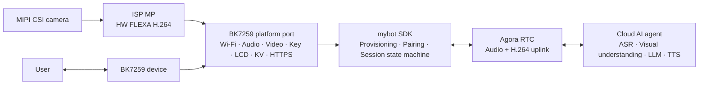

# mybot-bk7259

[](LICENSE)
[](https://github.com/junlon2006/mybot)
[](https://github.com/bekencorp/bk_avdk_smp)

**[简体中文](README.zh-CN.md) | English**

**mybot-bk7259** is the BK7259 reference implementation of the open-source
[mybot](https://github.com/junlon2006/mybot) AI multimodal conversation SDK. This repository organizes
the BK7259 AP/CP SDK, the AI solution, the BK7259 platform port, and a buildable dual-core firmware
project as pinned Git submodules. It is intended to provide reproducible builds, a practical
platform development baseline, and a shared foundation for community collaboration.

> This project is an actively developed BK7259 reference implementation. Before using it in a
> production product, complete the board-level adaptation, security review, and stability
> validation for the target hardware, and verify the licensing and commercial-use terms of all
> third-party components.

## Relationship to upstream mybot

[mybot](https://github.com/junlon2006/mybot) is a cross-platform AI multimodal conversation SDK for
edge devices. Its core is written in C99, uses AOSL as its portable runtime, and obtains device
capabilities such as Wi-Fi, persistent storage, buttons, displays, audio, encoded video, and network
transport through platform `ops` interfaces.

This repository does not redefine the mybot SDK. It provides the complete implementation required
to run mybot on the BK7259 platform:

- BK7259 AP/CP dual-core startup, memory layout, and Flash partition configuration.
- Wi-Fi APSTA provisioning with a captive portal, network reconnection, and credential persistence.
- Microphone capture with on-device hardware AEC, speaker playback, volume control, and audio power
  management.
- MIPI CSI camera capture, ISP MP scaling, hardware FLEXA H.264 encoding, and encoded video uplink.
- Resistor-ladder button, MIPI display, EasyFlash KV, HTTPS, and device identity adapters.
- Full-duplex audio and uplink video for AI multimodal sessions over Agora RTSA.
- Embedded Chinese and English OGG assets for provisioning prompts and pairing-code announcements.
- A complete flash image and an OTA package containing both the CP and AP firmware.

The device service, Agora RTC cloud service, and cloud AI agent are not part of this repository. A
device service compatible with the mybot protocol is required to run the complete workflow.

## System architecture



The BK7259 firmware uses an AP/CP dual-core architecture:

- **CP** performs base system initialization and SMP startup control.
- **AP** initializes the media service and runs the product control loop. It hosts the platform
  adapters, device lifecycle, networking, audio, video capture and encoding, display, and RTC
  session.
- **Control loop** ([ap_main.c](bk_solution_ai/projects/mybot/ap/ap_main.c)) selects APSTA
  provisioning or normal STA mode according to the saved Wi-Fi credentials. Once the network is
  up it starts the mybot SDK, and manages reconnection, reprovisioning, factory reset, and
  unexpected SDK exits.

## Repository layout

| Path | Responsibility | Tracking branch |
| --- | --- | --- |
| `bk_avdk_smp/` | BK7259 AP/CP SDK and platform foundation components | `release/v4.0.1-mybot` |
| `bk_solution_ai/` | AI solution, mybot SDK snapshot, BK7259 platform port, and firmware project | `release/v4.0.1-mybot` |
| `bk_solution_ai/projects/mybot/` | AP/CP entry points, board configuration, partition table, and prompt assets | From `bk_solution_ai` |
| `bk_solution_ai/components/mybot/` | mybot core and the `platforms/bk7259` implementation | From `bk_solution_ai` |

Both `-mybot` branches are this product's lines: they start at the corresponding BK7259
`release/v4.0.1` release and carry the MyBot changes on top, so a plain `release/v4.0.1` checkout
does not build this firmware. The gitlinks in the top-level repository pin both submodules to exact
commits so that every development environment uses the same source revisions. The `branch` values
in `.gitmodules` are used only when maintainers explicitly update the submodules from their
remotes.

`bk_solution_ai/components/mybot` is a component container holding three directories:

- `mybot_sdk` — the vendored mybot SDK source and the BK7259 platform operations (compiled as the
  `mybot_sdk` component).
- `mybot_aosl` — the vendored AOSL component (`mybot_aosl`).
- `mybot_rtsa` — the vendored Agora RTSA SDK (`include/` headers and
  `lib/arm/libagora-rtc-sdk.a`).

The solution vendors the mybot SDK from upstream commit
`4ae239c804257f8b5c557e5879b54d9a88d80847`. This upstream snapshot already contains the
`RTC_LOG_ERROR` and AOSL log-gate preservation; the remaining BK7259 target patch records debug
HTTPS request and response body logging in `SDK_REVISION`. It includes the RTM server-state LCD
indicators and the video uplink contract, which the current BK7259 AP build enables. `SDK_REVISION` records the
selected commit, target patch, and deterministic `include/` and `src/` digest. AOSL is based on commit
`84e086084ebcd0ae2455a0ce5721950c5fe2e656` with its five documented BK7259 HAL fixes. The build has
no `MYBOT_SDK_DIR` or external AOSL source-path input.

## Requirements

- Git with Git submodule support.
- A Linux build environment and the cross-compilation toolchain required by `bk_avdk_smp`.
- A BK7259 development board wired as Robot V2, or compatible hardware using the same peripheral
  connections.
- Access to a compatible mybot device service and valid Agora service configuration.

Board-level documentation ships inside the submodules: `bk_solution_ai/docs/bk7259/` for the
solution and the AVDK, and `bk_avdk_smp` for the SDK and flashing tools.

## Get the source

Clone the repository and its submodules over HTTPS:

```bash
git clone --recurse-submodules https://github.com/junlon2006/mybot-bk7259.git
cd mybot-bk7259
```

If the top-level repository has already been cloned without its submodules, run:

```bash
git submodule sync --recursive
git submodule update --init --recursive
```

After cloning, inspect the pinned revisions with:

```bash
git submodule status
```

When the GitHub downloads are slow, keep the canonical URLs in `.gitmodules` and use existing
local repositories only as command-scoped mirrors:

```bash
git -c protocol.file.allow=always \
    -c 'url.file:///path/to/bk_avdk_smp.insteadOf=https://github.com/junlon2006/bk_avdk_smp.git' \
    -c 'url.file:///path/to/bk_solution_ai.insteadOf=https://github.com/junlon2006/bk_solution_ai.git' \
    submodule update --init
```

This does not persist local paths or change the published submodule URLs.

## Build the firmware

`bk_avdk_smp` and `bk_solution_ai` must remain sibling directories. Run the following commands
from the repository root:

```bash
make -C bk_solution_ai/projects/mybot clean SDK_DIR="$PWD/bk_avdk_smp"
make -C bk_solution_ai/projects/mybot bk7259 SDK_DIR="$PWD/bk_avdk_smp"
```

Set `MYBOT_AUDIO_PTIME_MS` to `20`, `40`, or `60` when validating packet-time variants; the
default is `60`. Clean before switching variants so the value is applied by a fresh CMake
configure:

```bash
MYBOT_AUDIO_PTIME_MS=20 \
    make -C bk_solution_ai/projects/mybot bk7259 SDK_DIR="$PWD/bk_avdk_smp"
```

Build outputs are written to `bk_solution_ai/projects/mybot/build/bk7259/mybot/package/`:

| File | Purpose |
| --- | --- |
| `all-app.bin` | Complete flash image containing the bootloader, CP, and AP firmware |
| `app_pack.rbl` | OTA package containing both the CP and AP firmware |
| `build_summary.txt` | Flash, SRAM, IRAM, DTCM, and PSRAM usage report |

The individual CP and AP images are written to:

- `bk_solution_ai/projects/mybot/build/bk7259/mybot/bk7259/app.bin`
- `bk_solution_ai/projects/mybot/build/bk7259/mybot/bk7259_ap/app.bin`

## Flash and run

Use the Beken flashing tool to write `all-app.bin` to the device, following the instructions for
the target development board and the Beken flashing documentation shipped in `bk_avdk_smp`.

The reference device workflow is:

1. On first boot, or when no valid Wi-Fi credentials exist, the device enters APSTA provisioning
   mode and creates an open `mybot-xxxx` SoftAP.
2. Connect to the SoftAP and open `http://192.168.4.1/`, then select the target network and submit
   its credentials. The configuration page also opens on its own, without the address being typed
   — see [Wi-Fi provisioning](#wi-fi-provisioning).
3. After the STA link obtains an IPv4 address, the portal and SoftAP stop and the device starts the
   mybot SDK for registration, pairing, and authentication.
4. An unclaimed device displays and announces its pairing code. After the device is claimed, use the
   conversation button to start an AI multimodal conversation with full-duplex audio and camera
   video uplink.

The five reference-board buttons are wired as one hardware reset and two resistor ladders read on
ADC pads, so a button is identified by an ADC channel plus a voltage window rather than by a GPIO:

| Button | ADC | Window (mV) | Short press | Long press (about 2 s) |
| --- | --- | --- | --- | --- |
| S1 | — | — | Hardware `CEN` reset; firmware never sees it | — |
| S2 | 15 (GPIO13) | 500–1500 | Start or stop a conversation | Re-enter provisioning mode |
| S3 | 15 (GPIO13) | 4500–6000 | — | Factory reset and reboot |
| S4 | 4 (GPIO28) | 500–1500 | Decrease volume | — |
| S5 | 4 (GPIO28) | 4500–6000 | Increase volume | — |

GPIO assignments and display, audio, and camera peripheral connections are board-level
configuration.
Porting to different BK7259 hardware requires corresponding configuration and platform changes.

## Configuration

The primary project configuration files are:

- AP: `bk_solution_ai/projects/mybot/ap/config/bk7259_ap/defconfig`
- CP: `bk_solution_ai/projects/mybot/cp/config/bk7259/config`
- Flash partitions: `bk_solution_ai/projects/mybot/partitions/bk7259/auto_partitions.csv`
- SRAM/PSRAM layout: `bk_solution_ai/projects/mybot/partitions/bk7259/ram_regions.csv`

The `MyBot BK7259 platform` Kconfig menu provides:

- `CONFIG_MYBOT_LANGUAGE_ZH_CN`: Chinese service region, LCD text, and prompt assets.
- `CONFIG_MYBOT_LANGUAGE_EN_US`: English service region, LCD text, and prompt assets.
- `CONFIG_MYBOT_LVGL_UI_ANIMATIONS`: status animations at up to 10 fps, enabled by default.
- `CONFIG_MYBOT_LVGL_UI_LIGHT_THEME`: light UI theme; disabled by default for the dark theme.
- `CONFIG_MYBOT_VIDEO`: encoded H.264 video uplink; it is enabled in the current AP build.
- `CONFIG_MYBOT_VIDEO_WIDTH` / `CONFIG_MYBOT_VIDEO_HEIGHT`: `640x480` encoded output.
- `CONFIG_MYBOT_VIDEO_SENSOR_WIDTH` / `CONFIG_MYBOT_VIDEO_SENSOR_HEIGHT` /
  `CONFIG_MYBOT_VIDEO_SENSOR_FPS`: `1280x720` sensor input at `5` fps.
- `CONFIG_MYBOT_VIDEO_MIN_BPS` / `CONFIG_MYBOT_VIDEO_MAX_BPS`: encoder and RTSA bandwidth range,
  currently `256000` to `512000` bits per second.
- The ADC channel, both voltage window bounds, and the function of each button.

The language option selects the LCD text, service region, and prompt asset directory: Chinese
(`https://mybot.sh2.agoralab.co/api`) or English (`https://mybot.sg3.agoralab.co/api`). Exactly one
of the two language options must be enabled.

Everything else about the device identity is fixed by the port rather than configured:
[ap_main.c](bk_solution_ai/projects/mybot/ap/ap_main.c) derives the device id at runtime from the
per-chip device UID (read by the CP) using HMAC-SHA256 with `mybot-bk7259-device-id-v1` as the
derivation key. The first 12 digest bytes are uppercase hex, formatted as
`BK7259-<24 uppercase hex characters>`. It reports
the SDK's own `MYBOT_VERSION_STRING` as the firmware version and `mybot-bk7259` as the hardware
model, and prints both at startup. A device whose UID cannot be read has no identity, so it
logs the failure and does not start. Do not commit production service credentials.

## Keys

The two ADC ladders are why a button is identified by a channel plus a voltage window: both buttons
on one channel are distinguished only by the millivolts they produce. The windows on a channel must
not overlap, because the driver rejects an overlapping registration, and the defaults match Robot
V2. `CONFIG_ADC_KEY_LONG_PRESS_MS` sets the hold time before a long press fires; it is `2000`,
which is the "about two seconds" above.

The volume keys emit `MYBOT_KEY_EVENT_VOLUME_UP` / `MYBOT_KEY_EVENT_VOLUME_DOWN`; the SDK routes
those to `mybot_media_pipeline_adjust_volume()` and the platform volume adapter persists the
resulting level. They are only delivered while the SDK is running.

The S3 long press only posts a reset request — the erase runs after `mybot_stop()` has returned,
never while the SDK still holds EasyFlash or Wi-Fi. It wipes the EasyFlash environment, which holds
the Wi-Fi credential record, the device credential record, and the persisted volume, and then
reboots. The device comes back unprovisioned and raises its `mybot-xxxx` access point again. It is
long-press-only, so a stray touch on the button that sits next to the conversation key cannot erase
the device.

[usr_gpio_cfg.h](bk_solution_ai/projects/mybot/ap/config/bk7259_ap/usr_gpio_cfg.h) sets the
matching power-on pad state. The ADC pads stay high-Z with no pull, because an internal pull-up
would load the divider and skew the measured millivolts. That file also pins GPIO8/GPIO9, which are
the 32.768 kHz crystal (`P8/32K_XO`, `P9/32K_XI`) and not buttons.

## Display

The product owns one JD9855 MIPI display from platform preparation through platform shutdown, so
Wi-Fi provisioning remains visible while the mybot SDK is stopped. The native 320x385 panel is
rendered as a 385x320 logical RGB565 surface. GPIO53 enables panel power, GPIO5 drives reset, and
the GPIO7 backlight is active low.

The renderer adapts the shared `mybot-esp32` LVGL status view to the pinned AVDK LVGL 9.5.0
component. It covers all mybot workflow screens, pairing codes, Chinese and English text,
voiceprint registration, and the server's mutually exclusive `listening`, `thinking`, and
`speaking` indicators. Static emoji and lightweight status animations accompany the state cards.
The ready hint matches the conversation button. GPU and touch remain disabled; this status UI
does not display a camera preview.

The layout reserves space for the rounded bezel: the header is inset 40 pixels horizontally
and 14 from the top; the footer is inset 32 pixels horizontally and 18 from the bottom.

SDK render calls copy their content into one latest-state mailbox and wake the `mybot_ui` task.
That task alone updates the live view, advances LVGL timers, and flushes pixels. Intermediate
pending states may coalesce into the newest state. SDK LCD init/destroy only attach to and detach
from the product-owned display, so the UI task remains available for APSTA provisioning after the
SDK stops. Cross-thread and display-completion state uses the BK7259 AOSL atomic interfaces.

LVGL renders native RGB565 strips. The BK7259 backend rotates each changed rectangle into a free
full-frame buffer, preserves unchanged pixels from the previous frame, and submits through the
direct DSI bus, panel, and DPU APIs. A submitted frame is reused only after DPU's completion
callback returns its ownership. Shutdown waits for the UI task and display callbacks; failed
shutdown retains resources for a later retry.

The display memory budget is separate from the audio/video pipeline:

| Allocation | Size | Region |
| --- | --- | --- |
| Two 320x385 RGB565 scanout buffers | 2 x 246400 = 492800 bytes | Uncached media frame slab |
| One 385x16 RGB565 draw strip | 12320 bytes | HSRAM |
| UI task stack | 8192 bytes | HSRAM |
| Temporary LVGL draw layers | 16 KiB preferred layer size; 64 KiB aggregate limit | HSRAM |
| LVGL objects, styles, draw tasks, and RTOS control objects | Additional runtime allocations; peak requires target measurement | HSRAM / RTOS heaps |

`projects/mybot/ap/lv_conf_custom.h` selects `LV_USE_OS=LV_OS_NONE`, one software draw unit,
100 ms refresh, and HSRAM for LVGL's internal allocations. The 64 KiB draw-layer limit is not a
limit on total UI memory. Four constant 64x64 ARGB8888 emoji images occupy 65536 pixel bytes in
Flash, alongside the fixed UI font and LVGL's built-in fonts. The 20-pixel UI font covers ASCII
and the fixed Chinese UI vocabulary; arbitrary Chinese SSIDs or chat text need an extended font.
This font replaces the previous direct-renderer glyph subset. Resource provenance and licenses
are recorded in [display/SOURCES.md](bk_solution_ai/components/mybot/mybot_sdk/platforms/bk7259/display/SOURCES.md).
Build results, host tests and remaining hardware checks are recorded in
[UI_VALIDATION.md](bk_solution_ai/projects/mybot/UI_VALIDATION.md).

## Video uplink

The current AP build provides an uplink-only H.264 path: the `1280x720` MIPI CSI sensor runs at
`5` fps, the ISP MP path produces `640x480` NV12 frames, and the hardware FLEXA H.264 encoder sends
complete access units through the high-quality Agora RTSA stream. The device does not receive or
render remote video; its audio path remains full duplex.

Starting mybot initializes the video context but leaves the camera and encoder off. They are powered
and started only after RTC reports a connected session. Conversation teardown stops the video
worker, encoder, camera, and camera rail before leaving RTC; full SDK shutdown also stops and
destroys the source as a fallback. RTSA bandwidth-estimation callbacks update the encoder target
bitrate, clamped to `256000`-`512000` bits per second; the initial target is `384000` bits per second.
An RTSA key-frame request forces an IDR frame.

Video frames set the RTSA `frame_rate` metadata to `0`, leaving RTSA to follow the real send
timestamps rather than a second nominal frame-rate setting. The solution codec helper currently
uses a GOP of 30 frames, so periodic IDR frames are about six seconds apart at 5 fps; an RTSA
key-frame request can produce one sooner.

## Wi-Fi provisioning

Wi-Fi is owned by the product layer, independently of the mybot SDK lifecycle. On boot, the
firmware loads one versioned credential record from EasyFlash. A saved network is tried first; an
unprovisioned device, or a saved network that cannot obtain an IPv4 address, enters the built-in
APSTA portal described under [Flash and run](#flash-and-run).

The SoftAP hands the phone `192.168.4.1` as its only resolver and answers every DNS query with that
address, so the reachability probe a phone fetches on joining a network (`captive.apple.com`,
`generate_204`, ...) lands on the portal instead of failing to resolve; the portal answers those
paths with a redirect to itself, which is what makes the configuration page open without the user
typing the address. The DNS half is the `bk_avdk_smp` fix on the branch above; the redirect is in
the portal. A regular AP is unaffected, because the rewrite only happens while the SoftAP's own DNS
server is enabled.

Holding the configured conversation button for about two seconds requests reprovisioning. The key
callback only posts a request; the application waits for `mybot_stop()` to finish before starting
APSTA. After provisioning succeeds and the STA has IPv4, the application starts mybot again.
Provisioning and mybot are therefore never active concurrently.

## Embedded voice assets

Prompt assets are stored under `bk_solution_ai/projects/mybot/assets/locales/` as 16 kHz mono
Opus-in-Ogg files, one directory per language. They are compiled into the AP firmware as read-only
C arrays, require no SD card, and use no separate `assets_data` partition. Decoded PCM buffers are
allocated from PSRAM at runtime.

After modifying or adding an OGG file, regenerate the C arrays manually before building:

```bash
python3 bk_solution_ai/projects/mybot/scripts/generate_assets_c.py \
  bk_solution_ai/projects/mybot/assets \
  bk_solution_ai/components/mybot/mybot_sdk/platforms/bk7259/bk7259_assets.c
```

The generator collects only `locales/**/*.ogg`. See
[`projects/mybot/assets/README.md`](bk_solution_ai/projects/mybot/assets/README.md) for the audio
format and update procedure, and `scripts/convert_pcm_to_ogg.sh` for producing the Ogg files from
PCM.

## Source boundaries

- Vendored mybot SDK `include/` and `src/` are based on the upstream commit and include the BK7259
  target patches recorded in `mybot_sdk/SDK_REVISION`; they are not a byte-for-byte unmodified
  upstream snapshot.
- Vendored AOSL is locked to its recorded base and content digest, including the five declared
  BK7259 HAL modifications.
- `bk_avdk_smp` is consumed at `release/v4.0.1-mybot`, which is upstream `release/v4.0.1` plus this
  product's SDK-side fixes — today the captive-portal DNS server in the DHCP component, on both
  cores. The port adds no other tracked change to it, and mybot audio, video, APSTA, and display
  integration use only its public component APIs.
- BK platform sources include mybot only through `<mybot/platform/...>`.
- `projects/mybot/ap/ap_main.c` is the sole application lifecycle consumer of the public
  `<mybot/mybot.h>` API, and the only product source that includes the public
  `<mybot/mybot_version.h>`.
- The RTSA static library is linked normally, never with `--whole-archive`.
- The AVDK `agora-iot-sdk` component remains disabled; its older RTSA and AOSL are not part of this
  firmware.

## Submodule version management

Regular users should keep the revisions pinned by the top-level repository:

```bash
git pull --ff-only
git submodule sync --recursive
git submodule update --init --recursive
```

Maintainers can explicitly update both mybot branches with:

```bash
git submodule update --remote --checkout bk_avdk_smp bk_solution_ai
git diff --submodule=log
```

After an update, build and validate both submodules before updating the gitlinks in the top-level
repository. Do not commit `build/`, `__pycache__/`, or other locally generated files from a
submodule.

## Current bring-up limits

- The minimal APSTA uses an open local SoftAP and HTTP. Product deployment still needs a
  proof-of-possession or equivalent onboarding security decision.
- EasyFlash credential storage is functional but at-rest encryption still requires a product
  security decision.
- The target RTSA header distinguishes RTC and RTM tokens. Confirm that the device-service token is
  accepted by both before claiming end-to-end RTM.
- Hardware volume and local announcements are enabled in the minimal descriptor. The volume is
  persisted in EasyFlash and the announcement assets are embedded as Ogg/Opus in
  `projects/mybot/assets/`; wake words remain disabled.
- The encoded video path is configured for 5 fps, but its sustained frame cadence, bitrate
  adaptation, key-frame/GOP behavior, and repeated session start/stop still require runtime
  verification on the target camera hardware.
- The LVGL UI still requires target verification for panel rotation/colors, both languages,
  repeated SDK stop/provision/start, and HSRAM/stack peaks with simultaneous audio and video.
- The ADC key windows are the vendor Robot V2 defaults, validated on the Robot V2 board only. Each
  press logs the channel, the measured millivolts and the window it was matched against; on a board
  revision with different divider values, calibrate the `MYBOT_KEY_S*_MV_*` values from those
  readings if a button does not register.
- The S3 factory reset is destructive and cannot be undone from the device.

## Documentation

- [BK7259 MyBot project guide](bk_solution_ai/projects/mybot/README.md)
- [mybot project](https://github.com/junlon2006/mybot)
- [mybot English documentation](https://github.com/junlon2006/mybot/blob/main/README.md)
- [mybot porting guide](https://github.com/junlon2006/mybot/blob/main/docs/PORTING.md)
- [mybot embedded integration guide](https://github.com/junlon2006/mybot/blob/main/docs/EMBEDDED.md)
- [BK7259 SDK and solution documentation](bk_solution_ai/docs/bk7259/)

## Contributing

Issues and pull requests are welcome:

- Submit platform-independent SDK features and public API changes to the
  [upstream mybot project](https://github.com/junlon2006/mybot).
- Submit BK7259 platform or firmware changes to
  [bk_solution_ai](https://github.com/junlon2006/bk_solution_ai) or
  [bk_avdk_smp](https://github.com/junlon2006/bk_avdk_smp), then update the corresponding submodule
  pointer in this repository.
- Report integration, build, and documentation issues in
  [mybot-bk7259 Issues](https://github.com/junlon2006/mybot-bk7259/issues).

Keep each change focused. Describe the hardware, configuration, and validation used, and do not
commit build artifacts.

## License and third-party dependencies

Original content in this top-level repository is licensed under the
[Apache License 2.0](LICENSE).

The two submodules and their third-party components are governed by their respective licenses and
terms of use, including but not limited to:

- [bk_avdk_smp license](bk_avdk_smp/LICENSE)
- [bk_solution_ai license](bk_solution_ai/LICENSE)
- [AOSL license and additional terms](bk_solution_ai/components/mybot/mybot_aosl/aosl/LICENSE)
- [Prompt asset license](bk_solution_ai/projects/mybot/assets/LICENSE.xiaozhi-esp32)
- [LVGL license](bk_avdk_smp/ap/components/lvgl/LICENCE.txt)
- [LVGL view, font, and emoji provenance](bk_solution_ai/components/mybot/mybot_sdk/platforms/bk7259/display/SOURCES.md)
- [BK7259 third-party notices](bk_solution_ai/components/mybot/mybot_sdk/THIRD_PARTY_NOTICES.md)
- [mybot third-party notices](https://github.com/junlon2006/mybot/blob/main/THIRD_PARTY_NOTICES.md)

The AOSL license contains conditions in addition to Apache-2.0, so this combined project must not
be described as uniformly Apache-2.0 licensed.

The Agora RTSA binary is a proprietary build input and is not redistributed by the upstream mybot
SDK. It is vendored under `bk_solution_ai/components/mybot/mybot_rtsa` as the validated BK7259
package RTSA v1.10.1 build `1278380`, recorded in its `PACKAGE_INFO` and pinned by
`mybot_sdk/CMakeLists.txt` to the header and library digests:

```text
header   SHA256 29b1c21cbe416ee703eaa197ce623469619b1ed68cd3e9c66cb3abe2fafec7db
library  SHA256 40e8f93d9077eefe888e37b42ca0ddb5c7b2b6256b2f00cb7ba7c11c5551cb0f
```

Prebuilt binaries such as Agora RTSA may be subject to evaluation periods, redistribution
restrictions, and commercial licensing requirements. Before using this project in a product or
distributing firmware, independently review and comply with all applicable terms.
