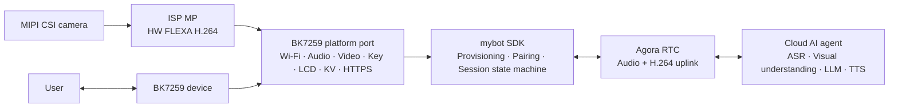

# mybot-bk7259

[](LICENSE)
[](https://github.com/junlon2006/mybot)
[](https://github.com/bekencorp/bk_avdk_smp)

**简体中文 | [English](README.md)**

**mybot-bk7259** 是开源 AI 多模态对话 SDK
[mybot](https://github.com/junlon2006/mybot) 面向 BK7259 AP/CP 平台的参考实现。
本仓库将 BK7259 双核 SDK、AI 解决方案、BK7259 平台适配和可直接构建的双核固件工程
以 Git submodule 方式组织并固定到经过验证的版本，用于复现构建、平台开发和社区协作。

> 本项目当前定位为 BK7259 参考实现，仍在持续开发中。用于量产产品前，请结合实际硬件
> 完成板级适配、安全审查、稳定性验证，并确认所有第三方组件的许可与商业使用条件。

## 与上游 mybot 的关系

[mybot](https://github.com/junlon2006/mybot) 是面向边缘设备的跨平台 AI 多模态对话 SDK。
其核心采用 C99 编写，依赖 AOSL 提供可移植运行时，并通过平台 `ops` 接口获取 Wi-Fi、
持久化存储、按键、显示、音频、视频和网络传输等设备能力。

本仓库不重新定义 mybot SDK，而是提供 BK7259 平台所需的完整实现：

- BK7259 AP/CP 双核启动、内存和 Flash 分区配置。
- Wi-Fi APSTA 配网（含强制门户）、网络重连和凭据持久化。
- 麦克风采集（片上硬件 AEC）、扬声器播放、音量控制和音频功耗管理。
- MIPI 摄像头采集、ISP 图像处理、硬件 FLEXA H.264 编码和 RTC 视频上行。
- 电阻梯按键、MIPI 显示、EasyFlash KV、HTTPS 和设备 UID 适配。
- 基于 Agora RTSA 的全双工音频和 H.264 视频上行 AI 多模态会话。
- 内嵌中英文 OGG 资源，用于配网提示音和配对码播报。
- 包含 CP 与 AP 固件的完整烧录镜像和 OTA 包。

设备服务、Agora RTC 云服务和云端 AI Agent 不在本仓库范围内。要跑通完整流程，
需要一个兼容 mybot 协议的设备服务。

## 系统架构



BK7259 固件采用 AP/CP 双核架构：

- **CP** 负责基础系统初始化和 SMP 启动控制。
- **AP** 初始化媒体服务并运行产品控制循环，承载平台适配、设备生命周期、网络、音频、
  视频采集与编码、显示和 RTC 会话。
- **控制循环**（[ap_main.c](bk_solution_ai/projects/mybot/ap/ap_main.c)）根据已保存的
  Wi-Fi 凭据选择 APSTA 配网还是正常 STA 模式；网络就绪后启动 mybot SDK，并负责重连、
  重新配网、恢复出厂设置和 SDK 异常退出。

## 仓库结构

| 路径 | 职责 | 跟踪分支 |
| --- | --- | --- |
| `bk_avdk_smp/` | BK7259 AP/CP SDK 与平台基础组件 | `release/v4.0.1-mybot` |
| `bk_solution_ai/` | AI 解决方案、mybot SDK 快照、BK7259 平台适配和固件工程 | `release/v4.0.1-mybot` |
| `bk_solution_ai/projects/mybot/` | AP/CP 入口、板级配置、分区表和提示音资源 | 随 `bk_solution_ai` |
| `bk_solution_ai/components/mybot/` | mybot 核心与 `platforms/bk7259` 实现 | 随 `bk_solution_ai` |

两个 `-mybot` 分支是本产品的开发分支：它们从对应的 BK7259 `release/v4.0.1` 版本拉出，
在其上叠加 MyBot 改动，因此直接检出 `release/v4.0.1` 无法构建本固件。顶层仓库的 gitlink
把两个子模块固定到确切 commit，以保证各开发环境使用同一份源码。`.gitmodules` 中的
`branch` 仅在维护者显式从远端更新子模块时使用。

`bk_solution_ai/components/mybot` 是一个组件容器，包含三个目录：

- `mybot_sdk` —— 内嵌的 mybot SDK 源码和 BK7259 平台操作（编译为 `mybot_sdk` 组件）。
- `mybot_aosl` —— 内嵌的 AOSL 组件（`mybot_aosl`）。
- `mybot_rtsa` —— 内嵌的 Agora RTSA SDK（`include/` 头文件与
  `lib/arm/libagora-rtc-sdk.a`）。

解决方案内嵌的 mybot SDK 以上游 commit
`83fbcb0969da4c73a5912326d699f90ec634b28e`（`main`，SDK 版本仍为 1.2.0）的完整源码快照
为基线，包含视频控制串行化、提示音延后销毁、统一的 RTM 到 LCD 状态处理，以及 RTM
`listening/thinking/speaking` 服务端状态 LCD indicator 和可选视频上行契约；BK7259 构建已启用
视频。该上游快照已经包含 `RTC_LOG_ERROR` 和恢复 AOSL 日志门限的修复；`SDK_REVISION` 另记录
调试固件打印 HTTPS 请求与响应 body 的 BK7259 目标 patch。`SDK_REVISION` 同时记录
`include/`、`src/` 的确定性聚合摘要。AOSL 基线为 commit
`84e086084ebcd0ae2455a0ce5721950c5fe2e656`，另有五处已记录的 BK7259 HAL 修改。构建过程不接受
`MYBOT_SDK_DIR` 或外部 AOSL 源码路径。

## 环境要求

- 支持 Git submodule 的 Git。
- Linux 构建环境，以及 `bk_avdk_smp` 所需的交叉编译工具链。
- 按 Robot V2 接线的 BK7259 开发板，或外设连接一致的兼容硬件。
- 可访问兼容的 mybot 设备服务和有效的 Agora 服务配置。

板级文档随子模块提供：解决方案与 AVDK 见 `bk_solution_ai/docs/bk7259/`，
SDK 与烧录工具见 `bk_avdk_smp`。

## 获取源码

通过 HTTPS 克隆本仓库及其子模块：

```bash
git clone --recurse-submodules https://github.com/junlon2006/mybot-bk7259.git
cd mybot-bk7259
```

如果顶层仓库已经克隆但未拉取子模块，执行：

```bash
git submodule sync --recursive
git submodule update --init --recursive
```

克隆后可用以下命令查看被固定的版本：

```bash
git submodule status
```

GitHub 下载缓慢时，请保留 `.gitmodules` 中的规范 URL，仅把本地仓库作为命令级镜像：

```bash
git -c protocol.file.allow=always \
    -c 'url.file:///path/to/bk_avdk_smp.insteadOf=https://github.com/junlon2006/bk_avdk_smp.git' \
    -c 'url.file:///path/to/bk_solution_ai.insteadOf=https://github.com/junlon2006/bk_solution_ai.git' \
    submodule update --init
```

该做法不会持久化本地路径，也不会修改对外发布的子模块 URL。

## 构建固件

`bk_avdk_smp` 与 `bk_solution_ai` 必须保持同级目录。在仓库根目录执行：

```bash
make -C bk_solution_ai/projects/mybot clean SDK_DIR="$PWD/bk_avdk_smp"
make -C bk_solution_ai/projects/mybot bk7259 SDK_DIR="$PWD/bk_avdk_smp"
```

如需分别编译中英文固件，在仓库根目录运行 `python3 scripts/build_all.py`。当前已启用
视频，产物分别是 `releases/bk7259-zh-CN-video.bin` 和
`releases/bk7259-en-US-video.bin`。用 `--language zh-CN` 或 `--language en-US`
可只编译一种语言；还支持 `--dry-run`、`--no-clean`、`--build-root` 和
`--output-root`。脚本在独立工程副本中分别编译 AP/CP，保留原工程配置与构建目录，
并在所选版本都成功后再发布固件。

验证不同打包时长时可设置 `MYBOT_AUDIO_PTIME_MS` 为 `20`、`40` 或 `60`，默认 `60`。
切换取值前必须先 clean，使该值在重新执行 CMake configure 时生效：

```bash
MYBOT_AUDIO_PTIME_MS=20 \
    make -C bk_solution_ai/projects/mybot bk7259 SDK_DIR="$PWD/bk_avdk_smp"
```

构建产物输出到 `bk_solution_ai/projects/mybot/build/bk7259/mybot/package/`：

| 文件 | 用途 |
| --- | --- |
| `all-app.bin` | 包含 bootloader、CP 与 AP 固件的完整烧录镜像 |
| `app_pack.rbl` | 包含 CP 与 AP 固件的 OTA 包 |
| `build_summary.txt` | Flash、SRAM、IRAM、DTCM 和 PSRAM 占用报告 |

CP 与 AP 的独立镜像分别位于：

- `bk_solution_ai/projects/mybot/build/bk7259/mybot/bk7259/app.bin`
- `bk_solution_ai/projects/mybot/build/bk7259/mybot/bk7259_ap/app.bin`

## 烧录与运行

使用 Beken 烧录工具把 `all-app.bin` 写入设备，具体步骤参考目标开发板说明和随
`bk_avdk_smp` 提供的 Beken 烧录文档。

参考设备的运行流程为：

1. 首次上电或没有有效 Wi-Fi 凭据时，设备进入 APSTA 配网模式，创建开放的
   `mybot-xxxx` SoftAP。
2. 连接该 SoftAP 并打开 `http://192.168.4.1/`，选择目标网络并提交凭据。配置页面也会
   自动弹出，无需手动输入地址，详见 [Wi-Fi 配网](#wi-fi-配网)。
3. STA 链路获取到 IPv4 地址后，门户和 SoftAP 停止，设备启动 mybot SDK 完成注册、配对
   和鉴权。
4. 未绑定的设备会显示并播报配对码；绑定完成后，用对话按键发起带全双工音频和摄像头
   视频上行的 AI 多模态对话。

参考板共有五个按键，其中一个直接接硬件复位，另外四个构成两条电阻梯并接到 ADC 引脚，
因此按键由「ADC 通道 + 电压窗口」而不是 GPIO 标识：

| 按键 | ADC | 窗口 (mV) | 短按 | 长按（约 2 秒） |
| --- | --- | --- | --- | --- |
| S1 | — | — | 硬件 `CEN` 复位，固件不可见 | — |
| S2 | 15 (GPIO13) | 500–1500 | 开始 / 结束对话 | 重新进入配网模式 |
| S3 | 15 (GPIO13) | 4500–6000 | — | 恢复出厂设置并重启 |
| S4 | 4 (GPIO28) | 500–1500 | 音量减 | — |
| S5 | 4 (GPIO28) | 4500–6000 | 音量加 | — |

GPIO 分配以及显示、音频和摄像头外设连接属于板级配置。移植到不同的 BK7259 硬件需要做
相应的配置和平台改动。

## 配置

主要工程配置文件：

- AP：`bk_solution_ai/projects/mybot/ap/config/bk7259_ap/defconfig`
- CP：`bk_solution_ai/projects/mybot/cp/config/bk7259/config`
- Flash 分区：`bk_solution_ai/projects/mybot/partitions/bk7259/auto_partitions.csv`
- SRAM/PSRAM 布局：`bk_solution_ai/projects/mybot/partitions/bk7259/ram_regions.csv`

`MyBot BK7259 platform` Kconfig 菜单提供：

- `CONFIG_MYBOT_LANGUAGE_ZH_CN`：中文服务区域、LCD 文案与提示音资源。
- `CONFIG_MYBOT_LANGUAGE_EN_US`：英文服务区域、LCD 文案与提示音资源。
- `CONFIG_MYBOT_LVGL_UI_ANIMATIONS`：最高 10 fps 的状态动画，默认启用。
- `CONFIG_MYBOT_LVGL_UI_LIGHT_THEME`：浅色 UI 主题，默认关闭并使用深色主题。
- `CONFIG_MYBOT_VIDEO`：启用编码视频上行，参考固件中已设为 `y`。
- `CONFIG_MYBOT_VIDEO_WIDTH` / `CONFIG_MYBOT_VIDEO_HEIGHT`：ISP 编码输出，参考值为
  `640x480`。
- `CONFIG_MYBOT_VIDEO_SENSOR_WIDTH` / `CONFIG_MYBOT_VIDEO_SENSOR_HEIGHT` /
  `CONFIG_MYBOT_VIDEO_SENSOR_FPS`：MIPI sensor 输入，参考值为 `1280x720@5fps`。
- `CONFIG_MYBOT_VIDEO_MIN_BPS` / `CONFIG_MYBOT_VIDEO_MAX_BPS`：H.264 码率范围，参考值为
  `256000` 到 `512000` bit/s。
- 每个按键的 ADC 通道、电压窗口上下界和对应功能。

语言选项同时决定 LCD 文案、服务区域和提示音资源目录：中文
（`https://mybot.sh2.agoralab.co/api`）或英文（`https://mybot.sg3.agoralab.co/api`）。
两个语言选项必须且只能启用一个。

设备身份不由配置决定：[ap_main.c](bk_solution_ai/projects/mybot/ap/ap_main.c) 在运行时
读取由 CP 提供的芯片唯一 UID，使用 HMAC-SHA256 和 `mybot-bk7259-device-id-v1` 派生密钥，
取摘要前 12 字节并转换为大写十六进制，格式为 `BK7259-<24位大写十六进制>`。固件版本上报 SDK 自身的
`MYBOT_VERSION_STRING`，硬件型号固定为 `mybot-bk7259`，两者在启动时打印。UID 无法读取的
设备没有身份，会打印失败日志并拒绝启动。请勿把生产环境服务凭据提交到仓库。

## 按键

按键采用电阻梯的原因就是「通道 + 电压窗口」的标识方式：同一通道上的两个按键只能靠
产生的毫伏值区分。同一通道的两个窗口不得重叠，驱动会拒绝重叠注册；默认值对应
Robot V2。`CONFIG_ADC_KEY_LONG_PRESS_MS` 决定长按判定时间，当前为 `2000`，即上文所说的
「约 2 秒」。

音量键上报 `MYBOT_KEY_EVENT_VOLUME_UP` / `MYBOT_KEY_EVENT_VOLUME_DOWN`，SDK 将其转发到
`mybot_media_pipeline_adjust_volume()`，平台音量适配层负责持久化结果。这两个事件只在
SDK 运行时投递。

S3 长按只提交复位请求 —— 擦除在 `mybot_stop()` 返回之后才执行，绝不在 SDK 仍持有
EasyFlash 或 Wi-Fi 时进行。擦除会清空 EasyFlash 环境（其中保存 Wi-Fi 凭据记录、设备
凭据记录和持久化音量），随后重启。设备重新回到未配网状态并再次拉起 `mybot-xxxx`
热点。该操作仅限长按，因此误触紧挨对话键的这颗按键不会擦除设备。

[usr_gpio_cfg.h](bk_solution_ai/projects/mybot/ap/config/bk7259_ap/usr_gpio_cfg.h)
设置对应的上电引脚状态。ADC 引脚保持高阻、不上拉，因为内部上拉会加载分压器、使测量
到的毫伏值偏移。该文件同时固定了 GPIO8/GPIO9，它们是 32.768 kHz 晶振
（`P8/32K_XO`、`P9/32K_XI`），不是按键。

## 显示

产品层从平台准备到平台关闭全程独占一块 JD9855 MIPI 屏，因此在 mybot SDK 停止期间配网
界面依然可见。物理分辨率为 320x385，按 385x320 的逻辑 RGB565 画面渲染。GPIO53 控制屏
供电，GPIO5 为复位，GPIO7 背光低有效。

渲染器将 `mybot-esp32` 的共享 LVGL 状态视图适配到锁定版本的 AVDK LVGL 9.5.0，覆盖全部
mybot 工作流界面、配对码、中英文文案、声纹注册，以及服务端互斥的 `listening`、
`thinking`、`speaking` 状态。状态卡片配有静态表情与轻量状态动画，就绪提示对应对话按键。
GPU 和触摸保持关闭；该状态 UI 不显示摄像头预览。

布局为屏幕圆角预留安全区域：页眉左右各内收 40 像素、距顶部 14 像素；底栏左右各内收
32 像素、距底部 18 像素。

SDK 的 render 调用将内容复制到一个保存最新状态的 mailbox，并唤醒 `mybot_ui` 任务。
只有该任务更新运行中的视图、执行 LVGL timer 和刷屏；来不及处理的中间状态可以合并为
最新状态。SDK 的 LCD init/destroy 只做产品自有显示的挂接与解挂，所以 SDK 停止后，UI
任务仍可显示 APSTA 配网页面。跨线程状态与显示完成状态使用 BK7259 的 AOSL 原子接口。

LVGL 生成原生 RGB565 条带，BK7259 后端将变化区域旋转写入空闲整帧缓冲，并从上一帧保留
未变化像素，再通过 DSI bus、panel 和 DPU 接口提交。已提交的缓冲必须等 DPU 完成回调
归还所有权后才能复用。关闭时等待 UI 任务与显示回调退出；关闭失败时保留资源，供后续重试。

显示内存预算与音视频流水线分开：

| 分配项 | 大小 | 内存区域 |
| --- | --- | --- |
| 两块 320x385 RGB565 扫描缓冲 | 2 x 246400 = 492800 字节 | 非缓存媒体 frame slab |
| 一块 385x16 RGB565 绘制条带 | 12320 字节 | HSRAM |
| UI 任务栈 | 8192 字节 | HSRAM |
| LVGL 临时绘制层 | 单层优选 16 KiB；总量上限 64 KiB | HSRAM |
| LVGL 对象、样式、绘制任务与 RTOS 控制对象 | 额外动态分配，峰值需目标机测量 | HSRAM / RTOS 堆 |

`projects/mybot/ap/lv_conf_custom.h` 选择 `LV_USE_OS=LV_OS_NONE`、单软件绘制单元、100 ms
刷新间隔，并用 HSRAM 分配 LVGL 内部对象。64 KiB 只限制绘制层，不是 UI 总内存上限。
构建结果、宿主测试和待上板检查项见
[UI_VALIDATION.md](bk_solution_ai/projects/mybot/UI_VALIDATION.md)。
四张常量 64x64 ARGB8888 表情共占 65536 字节 Flash 像素数据，另外还有固定 UI 字库和
LVGL 内置字体。20 像素 UI 字库覆盖 ASCII 与固定中文文案；任意中文 SSID 或聊天内容需要
扩充字库。新字库替代原先直接渲染的字形子集。资源来源与许可证记录在
[display/SOURCES.md](bk_solution_ai/components/mybot/mybot_sdk/platforms/bk7259/display/SOURCES.md)。

## 视频上行

当前 AP 构建提供只上行的 H.264 链路：`1280x720` MIPI CSI sensor 以 `5` fps 运行，ISP MP
生成 `640x480` NV12 帧，硬件 FLEXA H.264 编码器通过 Agora RTSA 主视频流发送完整 access
unit。设备不接收或渲染远端视频，音频链路仍为全双工。

启动 mybot 时只初始化视频 context，摄像头和编码器保持关闭；RTC 报告会话已连接后才给相机
上电并启动编码。结束对话时，在离开 RTC 前依次停止视频 worker、编码器、摄像头和相机电源；
完整 SDK 关闭流程也会再次执行 stop/destroy 作为兜底。RTSA 的带宽估计回调会更新编码器目标
码率，并钳制在 `256000` 到 `512000` bit/s，初始目标为 `384000` bit/s；RTSA 关键帧请求会
强制生成 IDR。

视频帧将 RTSA `frame_rate` 元数据设为 `0`，让 RTSA 使用真实发送时间戳，而不是引入第二个
名义帧率。Solution codec helper 当前使用 30 帧 GOP，因此在 5 fps 下周期性 IDR 间隔约为
6 秒；RTSA 关键帧请求可以提前生成 IDR。

## Wi-Fi 配网

Wi-Fi 由产品层独立于 mybot SDK 生命周期持有。启动时固件从 EasyFlash 读取一条带版本的
凭据记录：优先尝试已保存的网络；未配网设备或已保存网络拿不到 IPv4 地址时，进入
[烧录与运行](#烧录与运行) 中描述的 APSTA 门户流程。

SoftAP 通过 DHCP 只下发 `192.168.4.1` 作为解析器，并对所有 DNS 查询都回该地址，因此
手机加入网络后发起的连通性探测（`captive.apple.com`、`generate_204` 等）会落到门户上
而不是解析失败；门户对这些路径返回指向自身的重定向，这就是配置页面无需手动输入地址
即可弹出的原因。DNS 那一半是上面分支上的 `bk_avdk_smp` 修复，重定向在门户侧。普通 AP
不受影响，因为改写只在 SoftAP 自身的 DNS 服务启用时生效。

长按已配置的对话键约两秒可请求重新配网。按键回调只投递请求，应用会等 `mybot_stop()`
完成后再启动 APSTA。配网成功且 STA 拿到 IPv4 后，应用重新启动 mybot。因此配网与 mybot
永远不会并发运行。

## 内嵌语音资源

提示音资源以 16 kHz 单声道 Opus-in-Ogg 文件存放在
`bk_solution_ai/projects/mybot/assets/locales/`，每种语言一个子目录。它们被编译成只读
C 数组写入 AP 固件，无需 SD 卡，也不占用单独的 `assets_data` 分区。解码后的 PCM 缓冲
在运行时从 PSRAM 分配。

修改或新增 OGG 文件后，必须在构建前手动重新生成 C 数组：

```bash
python3 bk_solution_ai/projects/mybot/scripts/generate_assets_c.py \
  bk_solution_ai/projects/mybot/assets \
  bk_solution_ai/components/mybot/mybot_sdk/platforms/bk7259/bk7259_assets.c
```

生成脚本只收集 `locales/**/*.ogg`。音频格式与更新流程见
[`projects/mybot/assets/README.md`](bk_solution_ai/projects/mybot/assets/README.md)，
由 PCM 生成 Ogg 可参考 `scripts/convert_pcm_to_ogg.sh`。

## 源码边界

- 内嵌的 mybot SDK `include/`、`src/` 以上游完整快照为基线，并包含 `SDK_REVISION` 明示的
  BK7259 目标 patch；`platforms/` 是 BK7259 平台适配源码。
- 内嵌的 AOSL 锁定在记录的版本，包括已声明的五处 BK7259 HAL 修改。
- `bk_avdk_smp` 使用 `release/v4.0.1-mybot` 分支，它等于上游 `release/v4.0.1` 加上本产品
  的 SDK 侧修复 —— 目前是双核上的强制门户 DNS 服务。除此之外本移植不改动它的任何
  tracked 内容，mybot 的音频、视频、配网和显示集成只使用其公开组件 API。
- BK 平台源码只通过 `<mybot/platform/...>` 引用 mybot。
- `projects/mybot/ap/ap_main.c` 是公开 `<mybot/mybot.h>` API 的唯一应用生命周期使用者，
  也是唯一包含公开头 `<mybot/mybot_version.h>` 的产品源码。
- RTSA 静态库按常规方式链接，绝不使用 `--whole-archive`。
- AVDK 的 `agora-iot-sdk` 组件保持关闭，其较旧的 RTSA 和 AOSL 不属于本固件。

## 子模块版本管理

普通使用者应保持顶层仓库固定的版本：

```bash
git pull --ff-only
git submodule sync --recursive
git submodule update --init --recursive
```

维护者可显式更新两个 mybot 分支：

```bash
git submodule update --remote --checkout bk_avdk_smp bk_solution_ai
git diff --submodule=log
```

更新后请先构建并验证两个子模块，再更新顶层仓库中的 gitlink。不要提交子模块中的
`build/`、`__pycache__/` 等本地生成文件。

## 当前开发限制

- 最小 APSTA 使用本地开放 SoftAP 和明文 HTTP。量产部署仍需确定持有性证明或等效的
  入网安全方案。
- EasyFlash 凭据存储可用，但静态加密仍需产品安全决策。
- 目标 RTSA 头文件区分 RTC 与 RTM token，在宣称端到端 RTM 前需确认设备服务 token
  在两者中都被接受。
- 最小描述符中已启用硬件音量和本地提示音。音量持久化在 EasyFlash，提示音资源以
  Ogg/Opus 内嵌在 `projects/mybot/assets/`；唤醒词仍关闭。
- 编码视频链路已配置为 5 fps，但持续出帧节奏、码率自适应、关键帧/GOP 行为和重复会话
  start/stop 仍需在目标摄像头硬件上完成运行时验证。
- LVGL UI 仍需在目标机验证屏幕方向与颜色、中英文显示、反复停止 SDK/配网/启动，以及
  同时运行音视频时的 HSRAM 和栈峰值。
- ADC 按键窗口是厂商 Robot V2 默认值，仅在 Robot V2 板子上验证过。每次按下都会打印
  通道、实测毫伏值和匹配到的窗口；若换成分压值不同的板型，可据此校准
  `MYBOT_KEY_S*_MV_*`。
- S3 恢复出厂设置具有破坏性，且无法从设备侧撤销。

## 文档

- [BK7259 MyBot 工程说明](bk_solution_ai/projects/mybot/README_CN.md)
- [mybot 项目](https://github.com/junlon2006/mybot)
- [mybot 英文文档](https://github.com/junlon2006/mybot/blob/main/README.md)
- [mybot 移植指南](https://github.com/junlon2006/mybot/blob/main/docs/PORTING.md)
- [mybot 嵌入式集成指南](https://github.com/junlon2006/mybot/blob/main/docs/EMBEDDED.md)
- [BK7259 SDK 与解决方案文档](bk_solution_ai/docs/bk7259/)

## 贡献

欢迎提交 Issue 和 Pull Request：

- 与平台无关的 SDK 功能和公开 API 改动，请提交到
  [上游 mybot 项目](https://github.com/junlon2006/mybot)。
- BK7259 平台或固件改动，请提交到
  [bk_solution_ai](https://github.com/junlon2006/bk_solution_ai) 或
  [bk_avdk_smp](https://github.com/junlon2006/bk_avdk_smp)，然后在本仓库更新对应的
  子模块指针。
- 集成、构建和文档问题请提交到
  [mybot-bk7259 Issues](https://github.com/junlon2006/mybot-bk7259/issues)。

请保持每个改动聚焦，说明所用硬件、配置和验证方式，不要提交构建产物。

## 许可证与第三方依赖

本顶层仓库的原创内容采用 [Apache License 2.0](LICENSE) 许可。

两个子模块及其第三方组件分别受各自许可证和使用条款约束，包括但不限于：

- [bk_avdk_smp 许可证](bk_avdk_smp/LICENSE)
- [bk_solution_ai 许可证](bk_solution_ai/LICENSE)
- [AOSL 许可证及附加条款](bk_solution_ai/components/mybot/mybot_aosl/aosl/LICENSE)
- [提示音资源许可证](bk_solution_ai/projects/mybot/assets/LICENSE.xiaozhi-esp32)
- [LVGL 许可证](bk_avdk_smp/ap/components/lvgl/LICENCE.txt)
- [LVGL 视图、字体和表情来源](bk_solution_ai/components/mybot/mybot_sdk/platforms/bk7259/display/SOURCES.md)
- [BK7259 第三方声明](bk_solution_ai/components/mybot/mybot_sdk/THIRD_PARTY_NOTICES.md)
- [mybot 第三方声明](https://github.com/junlon2006/mybot/blob/main/THIRD_PARTY_NOTICES.md)

AOSL 许可证在 Apache-2.0 之外还包含附加条款，因此本项目不得被描述为整体采用
Apache-2.0 许可。

Agora RTSA 二进制属于专有构建输入，上游 mybot SDK 不再分发。本仓库将其内嵌在
`bk_solution_ai/components/mybot/mybot_rtsa`，为已验证的 BK7259 包 RTSA v1.10.1
构建 `1278380`，包名记录在其 `PACKAGE_INFO` 中，并由 `mybot_sdk/CMakeLists.txt` 固定
头文件与库的摘要：

```text
header   SHA256 29b1c21cbe416ee703eaa197ce623469619b1ed68cd3e9c66cb3abe2fafec7db
library  SHA256 40e8f93d9077eefe888e37b42ca0ddb5c7b2b6256b2f00cb7ba7c11c5551cb0f
```

Agora RTSA 等预编译二进制可能受试用期、再分发限制和商业许可约束。在用于产品或分发
固件之前，请自行确认并遵守所有适用条款。
